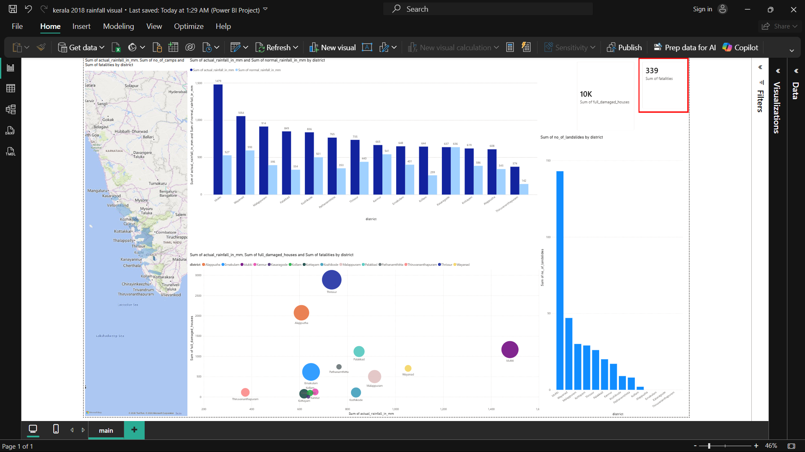

# Kerala Floods 2018 Analysis Dashboard

## 📌 Project Overview

This Power BI dashboard analyzes the impact of the 2018 Kerala floods using district-wise disaster data. The project transforms raw data into interactive visualizations to evaluate rainfall intensity, disaster impact, and district-level variations across Kerala.

---

## 📂 Dataset

- **Dataset:** district_wise_details.csv
- **Source:** Kerala State Disaster Management Authority (KSDMA)
- **Coverage:** District-wise flood statistics for all 14 districts of Kerala.

---

## 🎯 Objectives

- Compare actual rainfall with normal rainfall across districts.
- Identify districts most severely affected by the floods.
- Analyze the relationship between rainfall and flood damage.
- Provide interactive insights using Power BI visualizations.

---

## 🛠 Data Preparation

The following preprocessing steps were performed before visualization:

- Verified and corrected data types using Power Query.
- Created **Excess Rainfall** calculated column.
- Created **Percentage Deviation** from normal rainfall using DAX.
- Cleaned and validated district-wise data.

---

## 📊 Dashboard Visualizations

The dashboard consists of multiple interactive visualizations designed to provide a comprehensive overview of the impact of the 2018 Kerala floods.

| Visualization | Purpose |
|--------------|---------|
| 🗺️ Filled Map | Displays district-wise rainfall intensity across Kerala. |
| 📊 Clustered Column Chart | Compares actual rainfall with normal rainfall for each district. |
| 📈 Scatter Chart | Analyzes the relationship between rainfall and the number of fully damaged houses. |
| 📌 KPI Cards | Summarize key metrics such as total fatalities, relief camps, and fully damaged houses. |

## 📊 Dashboard Preview

